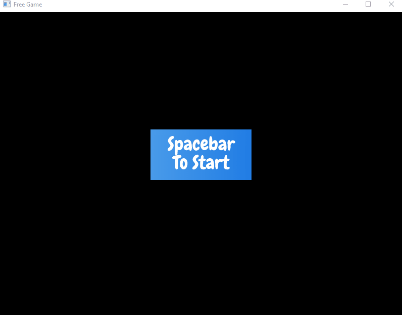
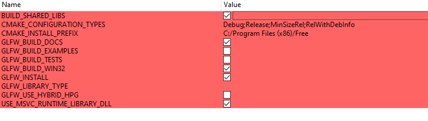

## *Free* - built with the *Yam* Engine
*Free* is a simple 2D maze game created using a custom built C++ based game engine. It uses GLFW to render the graphics and the engine abstracts most processes.
(Currently resizing is an issue, please keep at default: 800 x 600)

### Bot:
- [x] User can manipulate Entity called **Bot**
- [x] Bot moves with **arrow keys**
- [x] Bot state changes with keys: **A, S, or D**
- [x] Bot cannot move above the top of the game window
- [x] Bot cannot move below the bottom of the game window
- [x] Moving Bot past the left or right boundaries of the game window will loop the bot to other side
- [x] Bot cannot move past walls (stopped when collides)
- [x] Bot cannot change state if it results in collision with walls
  
### Maze:
- [x] Game has a start screen with simple animation
- [x] Press spacebar to start the game
- [x] Maze built with a vector of Entities
- [x] Infinitely moving Entity called **Sweeper**
- [x] Bot resets when it collides with the Sweeper
- [x] Game progressed when goal (green line) is reached
- [x] Stage 2 clones the Sweeper Entity
- [x] After stage 2 is the end credits
- [x] End credits has a short animation before exit(0) is called

## Demo:

## CMake Configuration:

## Building Process:
### The First milestone includes:
- [x] Rendering the map
- [x] Rendering the user and the enemy
- [x] Add continuous movement to the enemy
- [x] Add functionality: when user collides with enemy, respawn the user
- [x] Add functionality: user can change orientations
- [x] Add functionality: user can move with keyboard input

### The Second milestone includes:
- [x] Adding collisions to all of the walls

### The Third milestone includes:
- [x] Add functionality: Prevent user from changing orientations when it causes collision with a wall
- [x] A second map

### The Final milestone includes:
- [x] Start screen with animation
- [x] Add functionality: user input will start the game
- [x] End animation

